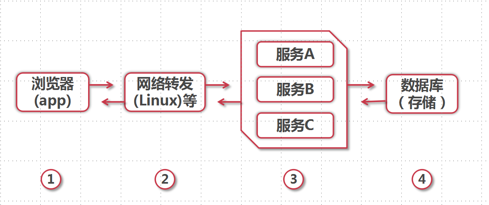
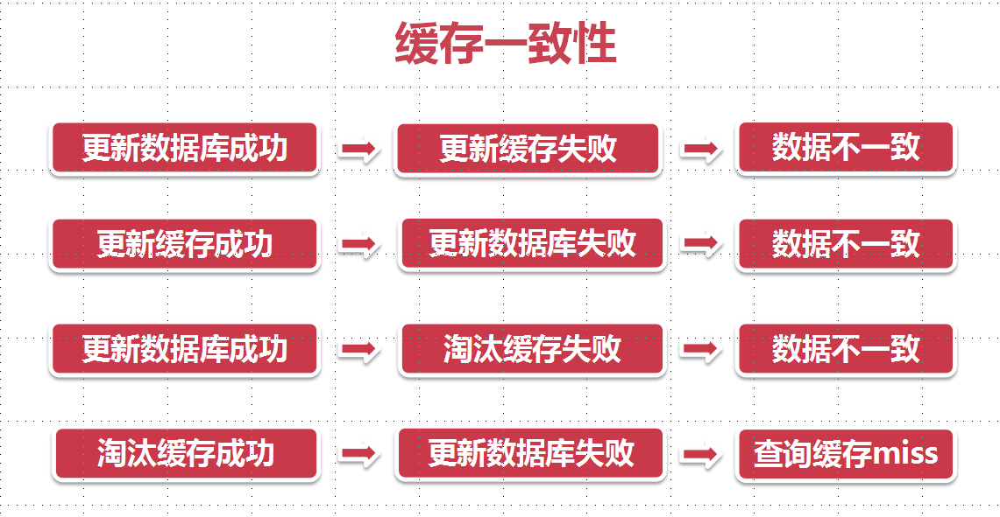
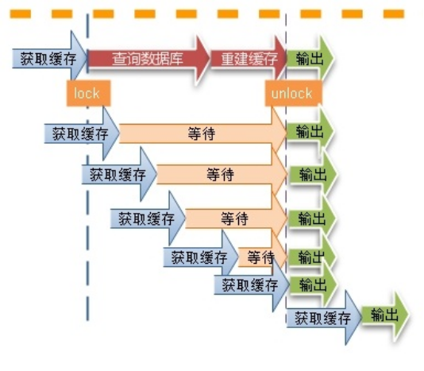

## 高并发处理思路与手段
### 高并发之扩容思路  
- 垂直扩容（纵向扩展）：提高系统部件能力（比如系统增加内存）  
- 水平扩容（横向扩展）：增加更多系统成员来实现（比如新增一台服务器）  
#### 扩容 - 数据库  
- 读操作扩展：memcache、 redis、 CDN等缓存  
- 写操作扩展：Cassandra、 Hbase等  
### 高并发之缓存思路
  
#### 缓存的特征  
- 命中率：命中率/(命中率 + 没有命中数)  
- 最大元素（空间）  
- 清空策略：FIFO（先进先出）、LFU（最小使用策略）、LRU（最近最少使用策略）、过期时间、随机等  
#### 缓存命中率影响因素  
- 业务场景和业务需求  
  缓存适合读多写少的场景，反之意义就不大。
  业务需求也决定了对实时性的需求，直接影响到缓存的过期时间和更新策略。实时性要求越低，越适合缓存。在相同key和相同请求数的情况下，缓存的时间越长，命中率越高  
- 缓存的设计（粒度和策略）  
  缓存的粒度越小，命中率越高  
- 缓存容量和基础设置  
  缓存的容量有限就容易引起缓存的失效和被淘汰，目前多数的缓存框架和中间件都采用了LRU算法  
  缓存的技术选型也是至关重要的，采用应用内置的本地缓存比较容易出现单机瓶颈，而采用分布式缓存就更容易扩展  

如果业务需求对数据实时性要求很高，而缓存时间又会影响缓存命中率，那么是否就不使用缓存？  
重要因素就是并发，在相同的缓存时间key的情况下，并发越高，缓存的收益也越高，即使缓存的时间很短！  
#### 缓存分类和应用场景  
- 本地缓存：编程实现（成员变量、局部变量、静态变量）、Guava Cache  
- 分布式缓存：Memcache、Redis  
#### 缓存 - Guava Cache  
  
继承了ConcurrentHashMap思路，使用多个Segment细粒度锁，保证线程安全的同时，支持高并发场景的需求。  
这里的Cache类似于map，存储键值对集合，不同的是还要处理缓存过期，动态加载等一些算法的逻辑，需要一些额外的信息来实现这些操作。  
对此，根据面向对象的思想，还需要做方法与数据关联性的封装，主要实现的缓存功能有节点加载进缓存节点中、当缓存的数据超过设置的最大值时使用LRU算法移除、具备根据节点上次被访问或写入的时间来计算过期机制  
缓存的key被封装在`WeakReference`引用内  
缓存的value被封装在`WeakReference`或者`SoftReference`引用内  
可以统计缓存使用过程中命中率/异常率/未命中率等数据  
#### 缓存 - Memcache  
应用比较广的开源分布式缓存产品之一，本身不提供分布式的解决方案  
在服务端，Memcache集群环境就是一个个Memcache服务器的堆集  
分布式重要在客户端实现，客户端的路由来处理达到分布式解决方案的目的  
客户端采用一致性hash算法作为路由策略  
  
Memcache内存结构  
  
Memcache将内存分为若干个slab，每个slab对应多个page，每个page默认1M，每个page包含一组chunk，chunk是真正存放数据的地方，同一个slab中的chunk大小是固定的。由相同大小的slab和chunk被组织在一起被称为slab_class  

限制和特性  
- 保存的item数据是没有限制的，只要内存足够  
- 单线程在32位机中最大使用内存2G，64位没有限制  
- key最大250字节
- 单个Item最大是1M（申请page只能1M，所以超过无法存储）  
- 服务器端是不安全的，知道某数据节点，可以直接操作失效  
- 不能遍历存储的所有Item(缓慢，且阻塞其他操作)  
#### 缓存 - Redis  
  
特点：
- 数据可以持久化，将内存中的数据保存在磁盘中，重启可以再次加载使用  
- 不仅支持简单的key-value，还提供了特殊的类型  
- 支持数据的备份

优势  
- 性能极高  
- 丰富的数据类型  
- 所有操作都是原子性的，并且支持一个操作合并后的原子性执行  
- 具有丰富的特性，支持publish/subscribe, 通知, key过期等等特性  
使用场景  
- 取最新n个数据的操作  
- 排行榜类似的应用，比如取top N的操作  
- 应用需要精准设定过期时间的应用  
- 计数器的应用  
- 适用于做唯一性检查的操作  
- 适用于实时系统和垃圾系统，pub/sub构建实时的消息系统，构建队列系统等  
- 最基础的缓存功能  
#### 缓存一致性  
  
#### 缓存并发问题  
  
如果是高并发情况下，可能会多个请求并发从数据库中获取数据，对后端数据库造成极大的冲击，甚至导致雪崩的现象。  
此外当某个缓存的key被更新时，同时也可能在被大量请求获取，会导致数据一致性的问题  
使用类似于锁的机制，在缓存更新或过期的情况下，先尝试获取到锁，当更新或者从数据库获取完成后再释放锁，其他请求只需要牺牲一定的等待时间，即可直接继续从缓存中获取数据  
#### 缓存穿透问题  
  
在高并发场景下，如果某一个key被高并发的访问，没有被命中，处于对容错性的考虑，会尝试从后端数据库中获取，从而导致大量的请求达到了数据库。而当该key对应的数据本身就是null的情况下，就导致数据库中并发的执行了很多不必要的查询操作，从而导致了巨大的冲击和压力  

解决方式：  
- 缓存空对象  
  对查询结果为空的对象也进行缓存，如果是集合可以缓存一个空的集合，但不是空，`null`  
  如果缓存单个对象，可以通过字段标识区分  
  这样请求传送到后端数据库，同时也需要保证缓存数据的时效性。  
  这样方式实现成本较低，适合命中率不高，但可能会频繁更新的数据  
- 单独过滤处理  
  对所有可能对应数据为空的key进行统一存放，在请求前做拦截，这样避免请求传送到后端数据库  
  这种实现相对复杂，比较适合命中不高，更新不频繁的数据  
#### 缓存的雪崩现象  
  
由于缓存的原因导致大量的请求到达后端数据库，从导致数据崩溃，整个系统崩溃，发生灾难
