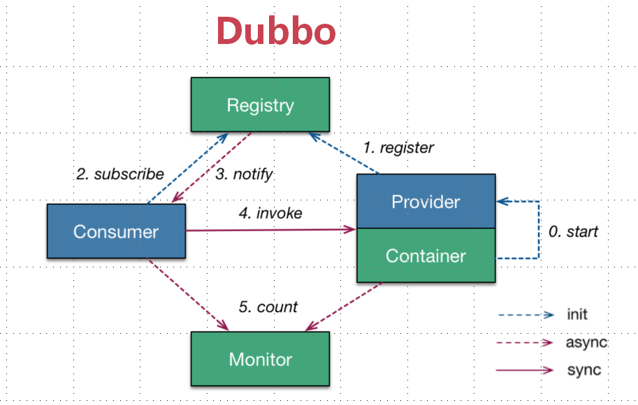
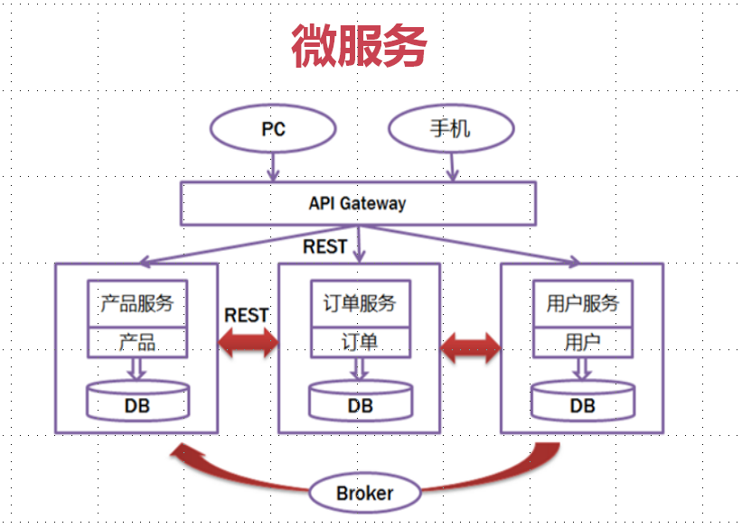
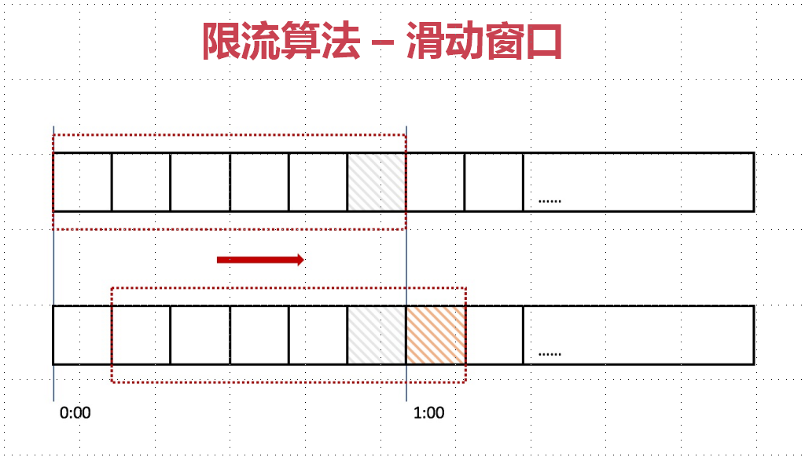

## 消息队列  
### 消息队列特性  
- 业务无关：只做消息分发  
- FIFO：先投递先到达  
- 容灾：节点的动态增删和消息的持久化  
- 性能：吞吐量提升，系统内部通信效率提高  
### 为什么需要消息队列  
- 【生产】和【消费】的速度或稳定性等因素不一致  
### 消息队列好处  
- 业务解耦  
- 最终一致性  
  用记录和补偿的方式处理。  
  做所有的不确定事情之前，先把事情记录下来，然后再执行。  
  结果通常分为三种，成功、失败、不确定（超时等，可以等价为失败）  
  如果为成功，可以将记录的东西清理掉，对于失败和不确定，可以依靠定时任务等方式，所有失败的事情重新执行，直到成功为止  
- 广播  
- 错峰与流控  
### 消息队列举例  
- Kafka  
- RabbitMQ  
### 队列 - Kafka  
  

## 应用拆分  
### 拆分原则  
- 业务优先  
- 循序渐进  
- 兼顾技术：重构、分层  
- 可靠测试  
### 拆分思考  
- 应用之间通信：RPC（dubbo等）、消息队列  
- 应用间数据库设计：每个应用都有独立的数据库  
- 避免事务操作跨应用  
### 服务化Dubbo  
  
### 微服务  
  
## 应用限流  
  
### 应用限流 - 算法  
- 计数器法  
  
- 滑动窗口  
  
- 漏桶算法  

- 令牌桶算法  
  
### 应用限流 - 算法对比  
- 计数器法 VS 滑动窗口  
- 漏桶算法 VS 令牌桶算法  
## 服务降级与服务熔断  
## 数据库切库、分库、分表  
- 数据库瓶颈  
  1. 单个库数据量太大（1T ~ 2T）：多个库  
  2. 单个数据库服务器压力过大、读写瓶颈：多个库  
  3. 单个表数据量过大：分表  
### 数据库切库  
- 切库的基础及实际运用：读写分离  
- 自定义注解完成数据库切库 - 代码实现 [地址](https://www.imooc.com/article/22556)  
### 数据库支持多个数据源与分库  
- 支持多数据源、分库  
- 数据库支持多个数据源 - 代码实现 [地址](https://www.imooc.com/article/22609)  
### 数据库分表  
- 什么时候考虑分表  
- 横向（水平）分表与纵向（垂直）分表  
- 数据库分表：mybatis分表插件 shardbatis2.0  [地址](https://www.imooc.com/article/25256)  
## 高可用的一些手段  
- 任务调度系统分布式：elastic-job + zookeeper  
- 主备切换：apache curator + zookeeper分布式锁实现  
- 监控报警机制 [地址](https://www.imooc.com/article/20891)  