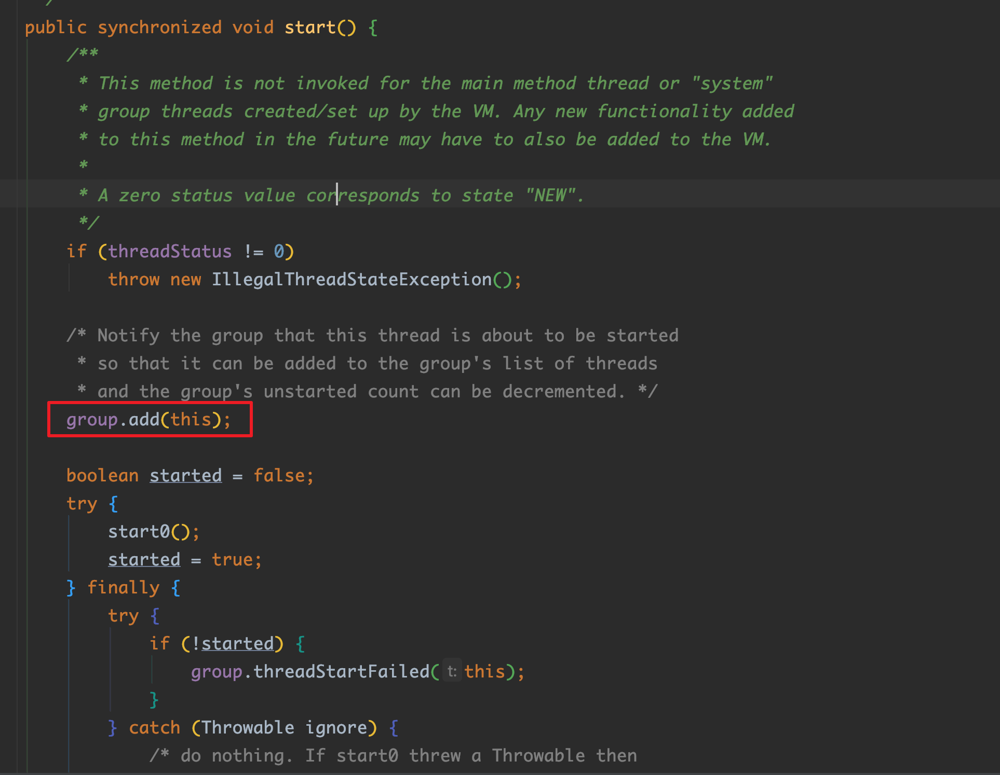
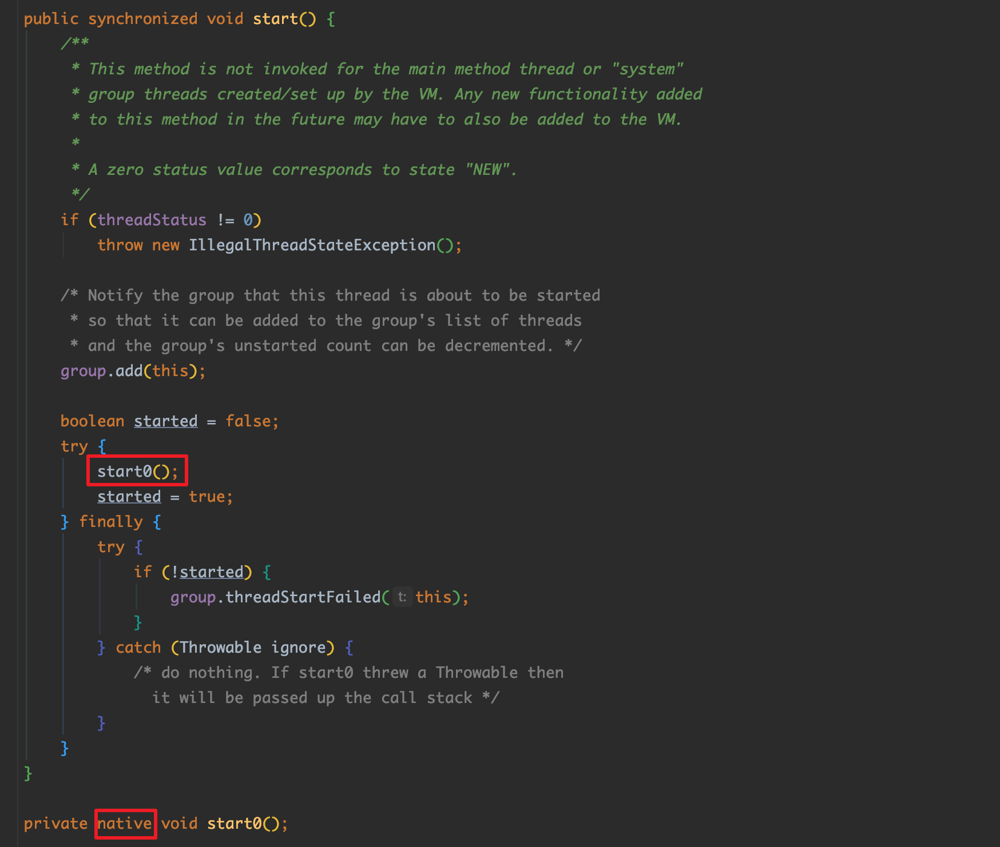

### start()和run()的比较

```java
/**
 * 对比 start()和run()两种启动线程的方式
 *
 * 结果：
 * main
 * Thread-0
 *
 * 说明runnable调用run()时，线程还未启动，仍然是主线程在执行 run()方法内的内容
 * 调用start()方法后，是新线程在执行，所以打印出新线程的名称
 */
public class StartAndRunMethod {
    public static void main(String[] args) {
        Runnable runnable = () -> {
            System.out.println(Thread.currentThread().getName());
        };
        runnable.run();
        new Thread(runnable).start();
    }
}
```

### start()方法原理解读

#### 方法含义

* 启动新线程

  线程对象初始化后，调用`start()`方法后，当前线程（通常是主线程）告诉`JVM`虚拟机：**如果虚拟机有空闲，来执行新线程任务**。

  启动一个线程的本质就是`请求JVM来运行线程`，至于线程何时能够运行，并不是简单的由程序能够决定的，而是由`线程调度器`决定的，如果它很忙，或许我们已经运行了start()方法，但是线程并不能够立刻启动。所以，start()方法调用结束以后，并不意味着线程已经运行，可能稍后运行，也可能很长时间不会运行，比如遇到`饥饿`的情况。

  start()方法其实会让两个线程同时运行，第一个就是主线程或者其他线程，因为必须要有一个线程来执行start()方法，第二个才是刚刚被创建的那个线程。一定区分`new Thread(runnable).start()`这句代码执行的线程不是新建的子线程。这行语句是由父线程或者主线程来执行的，执行成功后才会创建子线程

* 准备工作

  新建的子线程需要一些准备工作才能运行：首先自身处于就绪状态，已经获取到`除CPU外`的其他资源，比如已经设置了上下文、栈、线程状态、PC寄存器(指向程序运行的位置)。在做完准备工作后线程才可以被JVM或操作系统进一步调度到`执行状态`，调度到执行状态，等待CPU资源，然后才会真正进入到`执行状态`，执行run()方法中的代码。

* 不能重复调用start()方法

  ```java
  /**
   * 演示不能调用两次start()方法，否则报错
   * Exception in thread "main" java.lang.IllegalThreadStateException 非法的线程状态
   *
   */
  public class CantStartTwice {
      public static void main(String[] args) {
          Thread thread = new Thread();
          thread.start();
          thread.start();
      }
  }
  ```

#### 源码解析

* 启动新线程`检查`线程状态

  ```java
  		/* Java thread status for tools,
       * initialized to indicate thread 'not yet started'
       */
  
      private volatile int threadStatus = 0;
  
  		if (threadStatus != 0)
              throw new IllegalThreadStateException();
  ```

  

* 加入`线程组`

  

* 调用`start0()`

  

### run()方法原理解读

* 原理解析

  

* 两种情况

  1、直接执行Runnable对象的run()方法，就是一个普通的方法。执行这个方法的线程也是主线程

  2、想要启动一个线程，不能直接调用run()，而是要调用start()，间接调用run()方法

### 启动线程 - 常见问题

* 一个线程两次调用 start()方法会出现什么情况？为什么？

  1、会抛出异常，IllegalThreadStateException非法的线程状态

  2、因为JVM在启动新线程时会去检查线程状态，如果已经执行过start()方法，线程的状态已经改变，所以会抛出异常

  3、线程的6种状态

* 既然start()方法会调用run()方法，为什么选择调用start()方法，而不是直接调用run()方法呢？

  1、调用start()方法是真正意义上启动了一个线程，经历线程的各个生命周期；

  2、直接调用run()方法就相当于调用了一个普通的方法