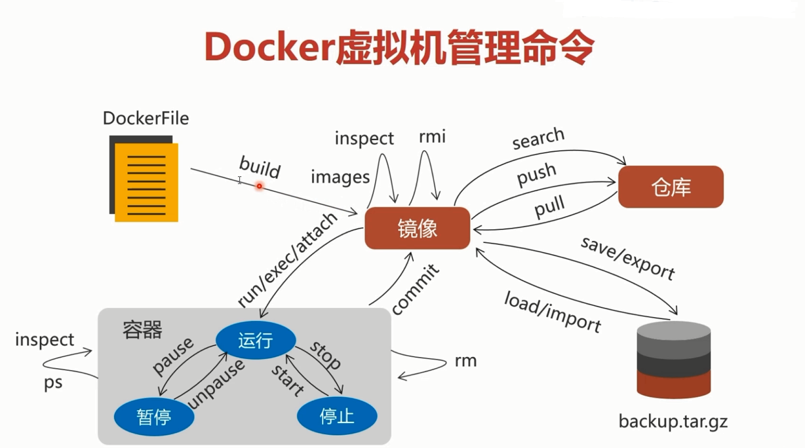

## Docker环境下的前后端分离项目部署与运维  
### Docker虚拟机  
#### 构架  
<table align="left">
    <tr>
        <td colspan="2" align="center">Docker架构</td>
    </tr>
    <tr>
        <td>应用</td>
        <td>应用</td>
    </tr>
    <tr>
        <td>系统库</td>
        <td>系统库</td>
    </tr>
    <tr>
        <td colspan="2" align="center">Docker引擎</td>
    </tr>
    <tr>
        <td colspan="2" align="center">宿主机系统</td>
    </tr>
    <tr>
        <td colspan="2" align="center">硬件</td>
    </tr>
</table>
Docker创建的所有虚拟实例共用同一个Linux内核，对硬件占用比较小，属于轻量级虚拟机  

#### Docker镜像与容器
* 容器是从镜像中创建出来的虚拟实例  
> 容器用来运行程序，是读写层  
> 镜像用来安装程序，是只读层  
#### centOS安装Docker虚拟机  
* 先更新yum软件管理器，然后再安装Docker  
```
yum -y update  
yum install -y docker  

// -y代表选择程序安装中的yes选项  
```
* 启动、关闭与重启  
```
service docker start
service docker stop
service docker restart
```
  

#### 在线安装镜像  
* 在线安装java镜像  
```
docker search java
docker pull java

// 国外镜像仓库下载速度较慢，建议使用国内镜像仓库，如DaoCloud

docker images // 查看docker安装的镜像
```
#### 导入导出镜像  
```
docker save java > /home/java.tar.gz // 导出镜像  
docker load < /home/java.tar.gz // 导入镜像  

docker images  // 查看镜像
docker rmi java // 删除某些无用镜像  
```
#### 启动容器  
```
docker run -it --name myjava java bash 
// -it 表示开启容器后开启交互界面  
// --name 可选项，给新建容器命名  
// java 镜像名  
// bash 启动容器使用bash程序

docker run -it --name myjava -p 9000:8080 -p 9001:8085 java bash
// -p 表示映射端口  
// 9000:8080 9000是宿主机端口 8080是docker端口  9000是操作系统的实际开放端口  
// 多个-p可以映射多个端口

docker run -it --name myjava -v /home/project:/soft --privileged java bash  
// -v 进行映射文件夹到容器中，供其使用（比如mysql的数据文件应该存储在Linux宿主机中方便备份及恢复）  
// 将宿主机中的/home/project目录映射到容器中的/soft目录下，两个内容以":"分隔  
// --privileged 映射目录的读写权限需要赋予docker  
```

进入容器后，使用`exit`来退出容器  
注：exit退出容器的命令行操作界面的同时，也会使该容器处于执行了`docker stop`状态，容器完全停止运行  
#### 暂停和停止容器  
```
// 暂停容器
docker pause myjava
// 恢复容器运行
docker unpause myjava
// 彻底停止运行容器
docker stop myjava
// 开始运行容器
docker start -i myjava

docker ps -a // 查看docker容器
```