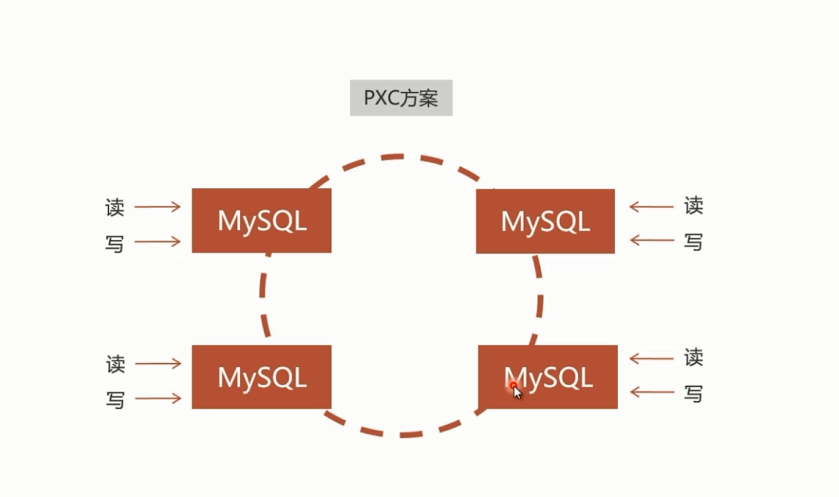
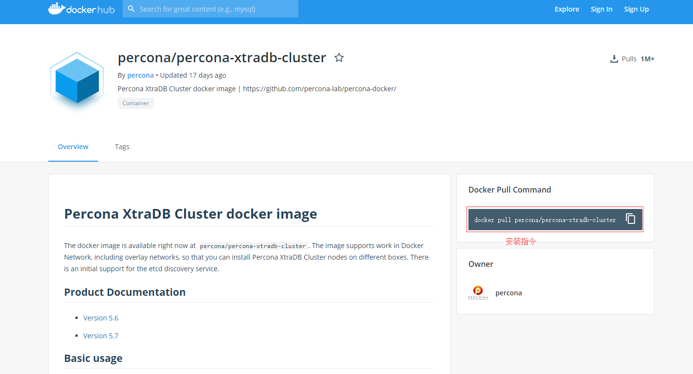
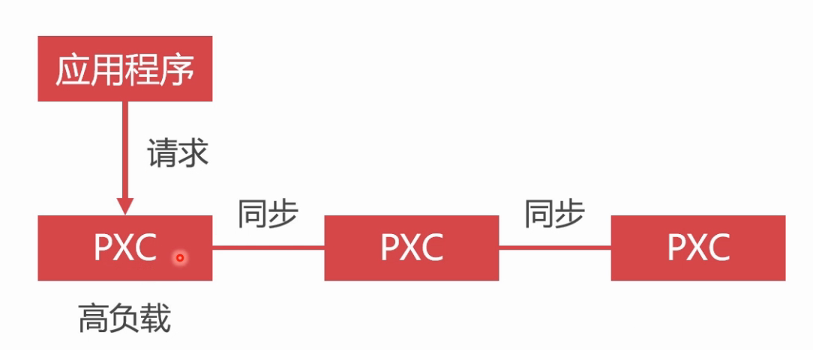
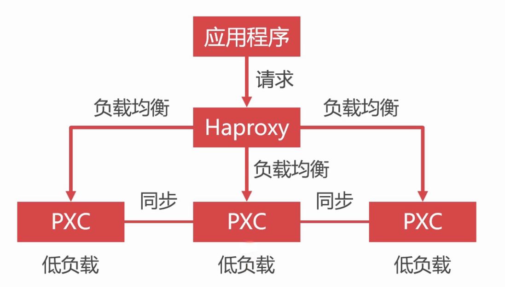
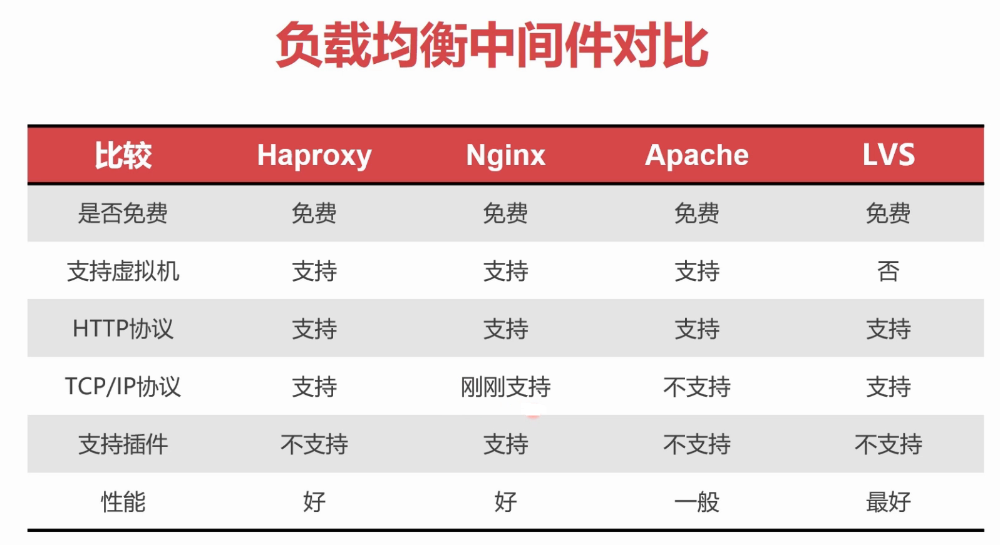
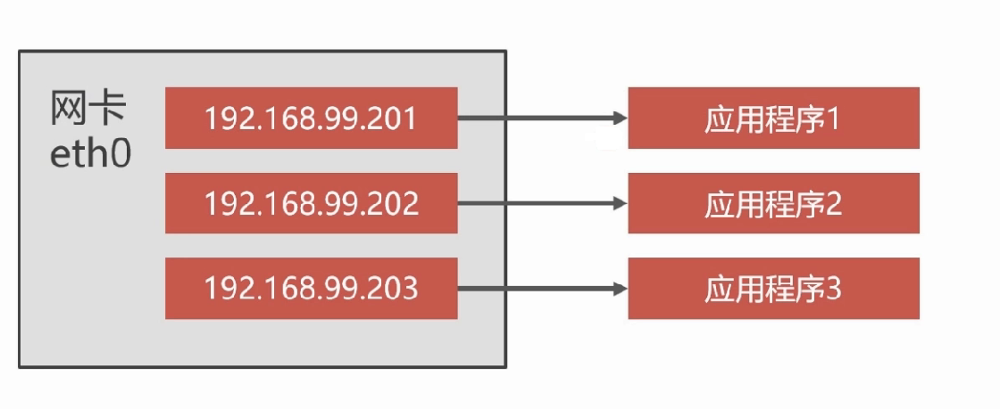
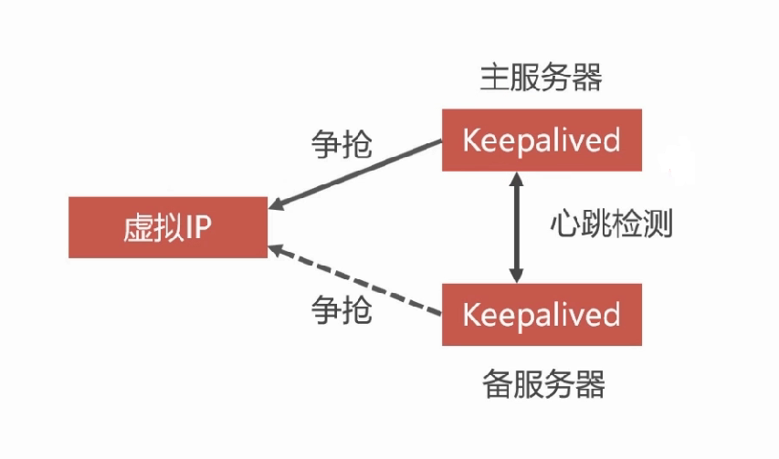
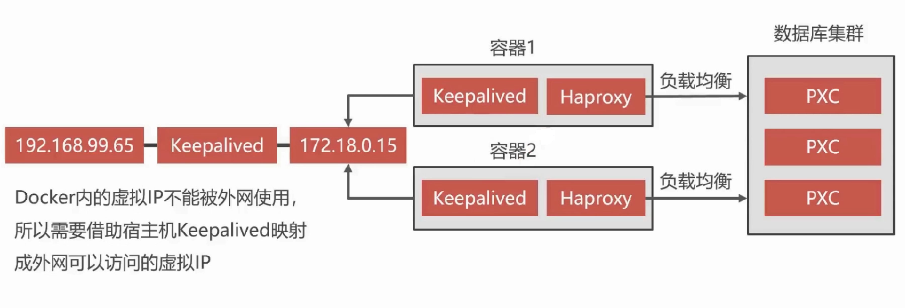

## Docker环境下MySQL集群方案介绍  
### 单节点数据库的弊病  
* 大型互联网程勋用户群体庞大，所以架构必须要特殊设计  
* 单节点的数据库无法满足性能上的要求  
* 单节点的数据库没有冗余设计，无法满足高可用  
### 常见MySQL集群方案  
* Replication： 速度快、弱一致性、低价值  
    常用：日志、新闻、帖子  

* PXC: 速度慢、强一致性、高价值  
    常用：订单、账户、财务  
### PXC原理  
* PXC（Percona CtraDB Cluster）  
* 建议使用PXC使用PerconaServer(MySQL改进版，性能提升很大)  
### PXC方案与Replication方案的对比  
  
PXC方案数据写入是双向的，再任何一个节点写入的数据都会同步到其他数据库节点上  
  
Replication方案数据同步是单向的  
如果在master数据写入，slave数据库可以读取  
但是如果是在slave写入，则不会同步到master数据库  

PXC的`数据强一致性`  
* 同步复制，事务在所有集群节点要么同时提交，要么不提交  
* Replication采用异步复制，无法保证数据的一致性  
### PXC集群安装介绍  
PXC集群比较特殊，只可以安装在Linux之上  
可以在Linux直接安装，也可以通过Docker安装    
* Docker的镜像仓库中包含了PXC数据库的镜像，下载即可  
* 访问网址：https://hub.docker.com/r/percona/percona-xtradb-cluster/  
  

### 安装PXC镜像  
    ```
    // 网络安装
    docker pull percona/percona-xtradb-cluster  

    // 本地安装  (提前有镜像的压缩包)
    docker load < /home/soft/pxc.tar.gz
    ```
注：如果镜像名称过长，可以修改  
> docker tag docker.io/percona/percona-xtradb-cluster pxc  
> docker rmi docker.io/percona/percona-xtradb-cluster  

### 创建内部网络  
* 出于安全考虑，需要给PXC集群实例创建Docker内部网络  
```
// 创建 net1 网段
docker network create net1 

// 查看 net1网段的相关信息  
docker network inspect net1 

// 删除 net1网段的信息
docker network rm net1 
```
### 创建Docker卷  
一般来说，业务数据都需要存储的宿主机中，通过目录映射的方式，Docker容器也可以使用所有数据  
pxc无法使用此方式  
所以需要使用新的方式来共享数据  `Docker卷`  
```
docker volume create --name v1
```
### 创建PXC容器  
* 只需要向PXC镜像传入相应运行参数创建PXC容器  
```
// 第一个PXC容器
docker run -d -p 3306:3306  
-v v1:/var/lib/mysql  
-e MYSQL_ROOT_PASSWORD=abc123456  
-e CLUSTER_NAME=PXC  
-e XTRABACKUP_PASSWORD=abc123456
--privileged --name=node1 --net=net1 --ip 172.18.0.2  
pxc  

// -d 创建出的容器在后台运行  
// MYSQL_ROOT_PASSWORD 用户名root无法修改  密码可以修改  
// CLUSTER_NAME 创建的PXC集群的名字
// XTRABACKUP_PASSWORD 数据库节点间同步密码

// 第一个节点创建很快，但是容器中的mysql初始化比较慢，需要两分钟左右  
// 最好使用客户端连接成功后再创建第二个节点  

// 第二个PXC容器
docker run -d -p 3307:3306  
-v v2:/var/lib/mysql  
-e CLUSTER_NAME=PXC  
-e XTRABACKUP_PASSWORD=abc123456  
-e CLUSTER_JOIN=node1   
--privileged --name=node2 --net=net1 --ip 172.18.0.3  
pxc  
```  
创建需要的所有容器，即集群创建完毕  

#### 搭建中遇到的问题  
1. Error response from daemon: User specified IP address is supported only when connecting to networks with user configured subnets  
    之前创建的net1网段有问题，需要直接给该网段指定subnet  
    删掉net1重新创建  
    docker network create --driver bridge --subnet 172.25.0.0/16 net1  

2. PXC容器的操作命令  
    ```
    查看容器  docker ps -a  
    停止容器  docker stop name(自己创建)
    删除容器  docker rm name(自己创建)
    ```
3. CentOS7防火墙开放端口  
    ```
    // 开放某个端口
    firewall-cmd --zone=public --add-port=3306/tcp --permanent  
    // 防火墙重启
    firewall-cmd --reload
    // 查看端口号是否开启
    firewall-cmd --query-port=3306/tcp
    ```
4. 创建语句  
    ```
    docker volume create --name disk1
    docker volume create --name disk2
    docker volume create --name disk3
    docker volume create --name disk4

    docker run -d -p 3306:3306 -v disk1:/var/lib/mysql -e MYSQL_ROOT_PASSWORD=123456 -e CLUSTER_NAME=PXC -e XTRABACKUP_PASSWORD=123456 --privileged --name=node1 --net=net1 --ip 172.18.0.2 pxc
    docker run -d -p 3307:3306 -e MYSQL_ROOT_PASSWORD=123456 -e CLUSTER_NAME=PXC -e XTRABACKUP_PASSWORD=123456 -e CLUSTER_JOIN=node1 -v disk2:/var/lib/mysql --privileged --name=node2 --net=net1 --ip 172.18.0.3 pxc
    docker run -d -p 3308:3306 -e MYSQL_ROOT_PASSWORD=123456 -e CLUSTER_NAME=PXC -e XTRABACKUP_PASSWORD=123456 -e CLUSTER_JOIN=node1 -v disk3:/var/lib/mysql --privileged --name=node3 --net=net1 --ip 172.18.0.4 pxc
    docker run -d -p 3309:3306 -e MYSQL_ROOT_PASSWORD=123456 -e CLUSTER_NAME=PXC -e XTRABACKUP_PASSWORD=123456 -e CLUSTER_JOIN=node1 -v disk4:/var/lib/mysql --privileged --name=node4 --net=net1 --ip 172.18.0.5 pxc
    ```
### 数据库负载均衡  
* 虽然搭建了集群，但是不使用数据库负载均衡，单节点处理所有请求，负载高，性能差  
  

* 使用Haproxy做负载均衡，请求被均匀分发给每个节点，单节点负载低，性能好  
  
Haproxy是一个老牌的中间件产品，具有良好的口碑    
  
#### 安装Haproxy镜像  
* Docker仓库中可以直接安装Haproxy镜像  
    ```
    docker pull haproxy
    ```
* Haproxy镜像中不包含Haproxy配置文件，所以在创建容器前，先创建配置文件  
    ```
    在宿主机中创建  
    touch /home/soft/haproxy.cfg  
    ```
    
    配置模板  
    ```
    global
    #工作目录
    chroot /usr/local/etc/haproxy
    #日志文件，使用rsyslog服务中local5日志设备（/var/log/local5），等级info
    log 127.0.0.1 local5 info
    #守护进程运行
    daemon

    defaults
        log	global
        mode	http
        #日志格式
        option	httplog
        #日志中不记录负载均衡的心跳检测记录
        option	dontlognull
        #连接超时（毫秒）
        timeout connect 5000
        #客户端超时（毫秒）
        timeout client  50000
        #服务器超时（毫秒）
        timeout server  50000

    #监控界面	
    listen  admin_stats
        #监控界面的访问的IP和端口
        bind  0.0.0.0:8888
        #访问协议
        mode        http
        #URI相对地址
        stats uri   /dbs
        #统计报告格式
        stats realm     Global\ statistics
        #登陆帐户信息
        stats auth  admin:123456
    #数据库负载均衡
    listen  proxy-mysql
        #访问的IP和端口
        bind  0.0.0.0:3306  
        #网络协议
        mode  tcp
        #负载均衡算法（轮询算法）
        #轮询算法：roundrobin
        #权重算法：static-rr
        #最少连接算法：leastconn
        #请求源IP算法：source 
        balance  roundrobin
        #日志格式
        option  tcplog
        #在MySQL中创建一个没有权限的haproxy用户，密码为空。Haproxy使用这个账户对MySQL数据库心跳检测
        option  mysql-check user haproxy
        server  MySQL_1 172.18.0.2:3306 check weight 1 maxconn 2000  
        server  MySQL_2 172.18.0.3:3306 check weight 1 maxconn 2000  
        server  MySQL_3 172.18.0.4:3306 check weight 1 maxconn 2000 
        server  MySQL_4 172.18.0.5:3306 check weight 1 maxconn 2000
        #使用keepalive检测死链
        option  tcpka  
    ```

    创建心跳检测得账号，不要赋予任何权限  
    ```
    在root权限下执行   CREATE USER 'haproxy'@'%' identified by '';
    ```
#### 创建Haproxy容器  
    ```
    // 4001:8888 使用Haproxy的web监控
    docker run -it -d
    -p 4001:8888 -p 4002:3306
    -v /home/soft/haproxy:/usr/local/etc/haproxy
    --name haproxy1  --privileged --net=net1  
    haproxy

    // 进入后台运行的容器haproxy1  
    docker exec -it haproxy1 bash

    // 进入容器后执行
    haproxy -f /usr/local/etc/haproxy/haproxy.cfg 
    ```
    在任意机器的浏览器访问http://宿主机ip:4001/dbs，输入配置文件中的账号和密码(我配置的是admin/123456)，即可远程监控  
      
    当某些节点出现故障时，监控界面会报红  
      

    模拟节点宕机后，无法使用`docker start -i node1`启动该节点，也是PXC强数据一致性的表现  
    所以解决方式是，删除所有节点和数据卷中的grastate.dat文件,重新执行集群创建的命令即可  
    数据都在数据卷中，所有集群重新启动都数据仍然都在.  
    ```
    docker rm node1 node2 node3 node4

    rm -rf /var/lib/docker/volumes/disk1/_data/grastate.dat
    rm -rf /var/lib/docker/volumes/disk2/_data/grastate.dat
    rm -rf /var/lib/docker/volumes/disk3/_data/grastate.dat
    rm -rf /var/lib/docker/volumes/disk4/_data/grastate.dat
    ```
* 单节点的Haproxy不具备高可用，必须要有冗余设计  
      

    使用Haproxy双机热备实现双节点或多节点Haproxy运行  
    使用到的技术，`虚拟IP地址`  
    Linux可以在网卡中定义多个IP地址，将不同的IP分配给对应的应用程序  
      
#### 利用Keepalived实现双机热备  

  
#### 安装Keepalived  
> Keepalived必须要安装到Haproxy所在的容器之内  
```
// 进入容器  
docker exec -it haproxy1 bash 
apt-get update  
apt-get install keepalived
// 因为Haproxy镜像使用的是Ubuntu创建出的，所以包安装命令也不同了
```
#### Keepalived配置文件  
* Keepalived的配置文件是/etc/keepalived/keepalived.conf  
```
apt-get install vim
vim /etc/keepalived/keepalived.conf  
```

```
vrrp_instance VI_1 {
    state MASTER
    interface eth0
    virtual_router_id 51
    priority 100
    advert_int 1
    authentication {
        auth_type PASS
        auth_pass 123456
    }
    virtual_ipaddress {
       	172.18.0.201
    }
}

// state MASTER Keepalived的身份（MASTER主服务，BACKUP备服务） 主服务会抢占虚拟IP，备服务不会抢占IP，将所有节点都配置成MASTER，则都抢占IP，未抢占到的自动降级成备服务  
// interface docker虚拟机网卡设备
// virtual_router_id 虚拟路由标识，Master和backup虚拟路由标示必须一致  
// priority 权重 数字越大越容易抢占虚拟IP
// advert_int Master与backup节点间同步检查的时间间隔，单位为秒。主备之间必须一致  
// authentication 心跳检测需要登录到相应服务中，配置账号密码
// 虚拟IP地址，可以设置多个，每行一个。只在docker内部显示
```
#### 启动Keepalived
> service keepalived start  
* 启动Keepalived之后，宿主机可以通过Ping通虚拟IP  
####  冷备份数据  
* 冷备份是关闭数据库时候的备份方式，通常做法是拷贝数据文件  
* 冷备份是最简单最安全的一种备份方式  
* 大型网站无法做到关闭业务备份数据，所以冷备份不是最佳选择  
  集群中也可以通过断开集群中的一个节点，备份后，再将节点重启加入集群  
    
#### 热备份  
* 热备份是在系统运行的状态下备份数据，也是难度最大的备份  
* MySQL常见的热备份有LVM和XtraBackup两种方案  

LVM是Linux自带的一种备份方式，对某一分区创建快照，实现对分区的数据备份  
原则上可以备份任何数据库，缺点是会对数据库加锁，只能读取数据，不能写入数据  

* 建议使用XtraBackup热备MySQL：不需要锁表  
#### XtraBackup介绍  
* XtraBackup是一款基于InnoDB的在线热备工具，具有开源免费，支持在线热备，占用磁盘空间小，能够非常快速地备份与恢复mysql数据库  
* XtraBackup优势  
    1. XtraBackup备份过程不锁表、快速可靠  
    2. XtraBackup备份过程不会打断正在执行的事务  
    3. XtraBackup能够基于压缩等功能节约磁盘空间和流量  
* 全量备份和增量备份  
    全量备份是备份全部数据。备份过程时间长，占用空间大  
    增量备份是只备份变化的那部分数据。备份时间短，占用空间小  
#### XtraBackup备份的准备工作  
XtraBackup此备份工具是安装在数据库节点所在容器内，备份出的数据就会保存在容器内  
这肯定不符合我们的预想，所以应该通过映射，将备份的数据，导出在宿主机分区中  
在宿主机上创建数据卷，把数据卷映射到某一个节点上，这样热备工具备份的数据在宿主机上就可以查看了  
```
// 创建数据卷  
docker volume create backup  
// 停掉node1，删除后新建node1  因为新的参数无法添加到已经创建的容器中  
docker stop node1
docker rm node1  
docker run -d -p 3306:3306 -e MYSQL_ROOT_PASSWORD=123456 -e CLUSTER_NAME=PXC -e XTRABACKUP_PASSWORD=123456 -v disk1:/var/lib/mysql -v backup:/data --privileged -e CLUSTER_JOIN=node2 --name=node1 --net=net1 --ip 172.18.0.2 pxc
```
#### PXC全量备份步骤  
* PXC容器中安装XtraBackup，并执行备份  
```
apt-get update
apt-get install percona-xtrabackup-24  
innobackupex --user=root --password=123456 /data/backup/full   
```
#### PXC全量恢复步骤  
* 数据库可以热备份，但是不能热还原。为了避免恢复过程中的数据同步，采用空白的MySQL还原数据，然后再建立PXC集群  

PXC集群实现冷还原步骤  
1. 解散PXC集群，把数据节点都删掉  
2. 创建一个新的数据节点，数据节点执行冷还原  
3. 再创建其他节点，和执行还原的节点进行数据同步    

* 还原数据前要将未提交的事务回滚，还原数据之后重启MySQL

```
rm -rf /var/lib/mysql/*  //删除MySQL内部数据  
innobackupex --user=root --password=123456 --apply-back /data/backup/full/xxxxx(备份文件)/  // 把没有提交的事务回滚
innobackupex --user=root --password=123456 --copy-back /data/backup/full/xxxxx(备份文件)/  // 执行全量冷还原

```