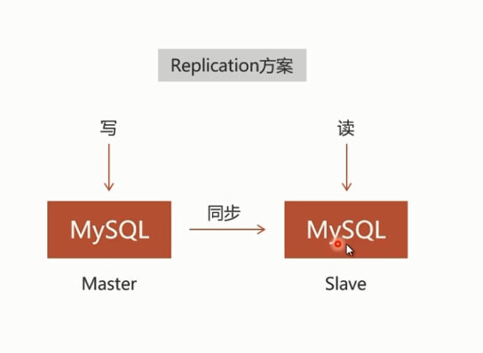

## Docker环境下MySQL集群方案介绍  
### 单节点数据库的弊病  
* 大型互联网程勋用户群体庞大，所以架构必须要特殊设计  
* 单节点的数据库无法满足性能上的要求  
* 单节点的数据库没有冗余设计，无法满足高可用  
### 常见MySQL集群方案  
* Replication： 速度快、弱一致性、低价值  
    常用：日志、新闻、帖子  

* PXC: 速度慢、强一致性、高价值  
    常用：订单、账户、财务  
### PXC原理  
* PXC（Percona CtraDB Cluster）  
* 建议使用PXC使用PerconaServer(MySQL改进版，性能提升很大)  
### PXC方案与Replication方案的对比  
  
PXC方案数据写入是双向的，再任何一个节点写入的数据都会同步到其他数据库节点上  
  
Replication方案数据同步是单向的  
如果在master数据写入，slave数据库可以读取  
但是如果是在slave写入，则不会同步到master数据库  

PXC的`数据强一致性`  
* 同步复制，事务在所有集群节点要么同时提交，要么不提交  
* Replication采用异步复制，无法保证数据的一致性  
### PXC集群安装介绍  
PXC集群比较特殊，只可以安装在Linux之上  
可以在Linux直接安装，也可以通过Docker安装    
* Docker的镜像仓库中包含了PXC数据库的镜像，下载即可  
* 访问网址：https://hub.docker.com/r/percona/percona-xtradb-cluster/  
  

### 安装PXC镜像  
    ```
    // 网络安装
    docker pull percona/percona-xtradb-cluster  

    // 本地安装  (提前有镜像的压缩包)
    docker load < /home/soft/pxc.tar.gz
    ```
注：如果镜像名称过长，可以修改  
> docker tag docker.io/percona/percona-xtradb-cluster pxc  
> docker rmi docker.io/percona/percona-xtradb-cluster  

### 创建内部网络  
* 出于安全考虑，需要给PXC集群实例创建Docker内部网络  
```
// 创建 net1 网段
docker network create net1 

// 查看 net1网段的相关信息  
docker network inspect net1 

// 删除 net1网段的信息
docker network rm net1 
```
### 创建Docker卷  
一般来说，业务数据都需要存储的宿主机中，通过目录映射的方式，Docker容器也可以使用所有数据  
pxc无法使用此方式  
所以需要使用新的方式来共享数据  `Docker卷`  
```
docker volume create --name v1
```
### 创建PXC容器  
* 只需要向PXC镜像传入相应运行参数创建PXC容器  
```
// 第一个PXC容器
docker run -d -p 3306:3306  
-v v1:/var/lib/mysql  
-e MYSQL_ROOT_PASSWORD=abc123456  
-e CLUSTER_NAME=PXC  
-e XTRABACKUP_PASSWORD=abc123456
--privileged --name=node1 --net=net1 --ip 172.18.0.2  
pxc  

// -d 创建出的容器在后台运行  
// MYSQL_ROOT_PASSWORD 用户名root无法修改  密码可以修改  
// CLUSTER_NAME 创建的PXC集群的名字
// XTRABACKUP_PASSWORD 数据库节点间同步密码

// 第一个节点创建很快，但是容器中的mysql初始化比较慢，需要两分钟左右  
// 最好使用客户端连接成功后再创建第二个节点  

// 第二个PXC容器
docker run -d -p 3307:3306  
-v v2:/var/lib/mysql  
-e CLUSTER_NAME=PXC  
-e XTRABACKUP_PASSWORD=abc123456  
-e CLUSTER_JOIN=node1   
--privileged --name=node2 --net=net1 --ip 172.18.0.3  
pxc  
```  
创建需要的所有容器，即集群创建完毕  