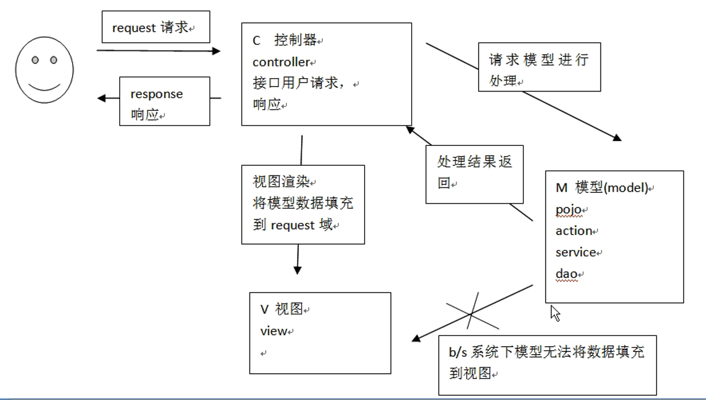
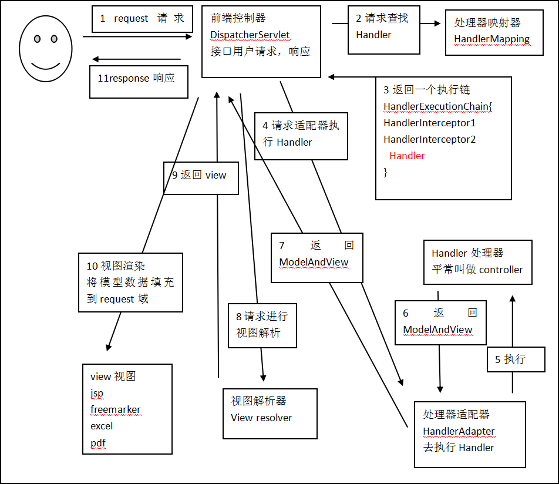

## springmvc框架
### 什么是springmvc
springmvc是spring框架的一个模块，springmvc和spring无需通过中间整合层进行整合  
springmvc是一个基于mvc的web框架  
### mvc在b/s系统 下的应用
mvc是一个设计模式，mvc在b/s系统下的应用  

1.  用户发起request请求至控制器(Controller),控制器接收用户请求的数据，委托给模型进行处理  
2. 控制器通过模型(Model)处理数据并得到处理结果。模型通常是指业务逻辑
3.  模型处理结果返回给控制器  
4.  控制器将模型数据在视图(View)中展示  
    web中模型无法将数据直接在视图上显示，需要通过控制器完成。如果在C/S应用中模型是可以将数据在视图中展示的  
5.  控制器将视图response响应给用户  
    通过视图展示给用户要的数据或处理结果  
### Spring web mvc框架

*   架构流程  
    第一步：发起请求到前端控制器(DispatcherServlet)  

    第二步：前端控制器请求HandlerMapping查找 Handler  
    可以根据xml配置、注解进行查找  
    
    第三步：处理器映射器HandlerMapping向前端控制器返回Handler  
    
    第四步：前端控制器调用处理器适配器去执行Handler  
    
    第五步：处理器适配器去执行Handler  
    
    第六步：Handler执行完成给适配器返回ModelAndView  
    \
    第七步：处理器适配器向前端控制器返回ModelAndView  
    ModelAndView是springmvc框架的一个底层对象，包括 Model和view

    第八步：前端控制器请求视图解析器去进行视图解析  
    根据逻辑视图名解析成真正的视图(jsp)

    第九步：视图解析器向前端控制器返回View  

    第十步：前端控制器进行视图渲染  
    视图渲染将模型数据(在ModelAndView对象中)填充到request域  

    第十一步：前端控制器向用户响应结果  

1.  用户发送请求至前端控制器DispatcherServlet  
2.  DispatcherServlet收到请求调用HandlerMapping处理器映射器  
3.  处理器映射器根据请求url找到具体的处理器，生成处理器对象及处理器拦截器(如果有则生成)一并返回给DispatcherServlet  
4.  DispatcherServlet通过HandlerAdapter处理器适配器调用处理器  
5.  执行处理器(Controller，也叫后端控制器)  
6.  Controller执行完成返回ModelAndView  
7.  HandlerAdapter将controller执行结果ModelAndView返回给DispatcherServlet  
8.  DispatcherServlet将ModelAndView传给ViewReslover视图解析器  
9.  ViewReslover解析后返回具体View  
10.  DispatcherServlet对View进行渲染视图（即将模型数据填充至视图中）  
11.  DispatcherServlet响应用户  

*   组件说明
1.  前端控制器DispatcherServlet（不需要程序员开发）  
    作用接收请求，响应结果，相当于转发器，中央处理器  
    有了DispatcherServlet减少了其它组件之间的耦合度  
2.  处理器映射器HandlerMapping(不需要程序员开发)  
    作用：根据请求的url查找Handler  
3.  处理器适配器HandlerAdapter  
    作用：按照特定规则（HandlerAdapter要求的规则）去执行Handler  
4.  处理器Handler(需要程序员开发)  
    注意：编写Handler时按照HandlerAdapter的要求去做，这样适配器才可以去正确执行Handler  
5.  视图解析器View resolver(不需要程序员开发)  
    作用：进行视图解析，根据逻辑视图名解析成真正的视图（view）  
6.  视图View(需要程序员开发jsp)  
    View是一个接口，实现类支持不同的View类型（jsp、freemarker、pdf...）  

    以下组件通常使用框架提供实现：  
    【1】DispatcherServlet：前端控制器  
    用户请求到达前端控制器，它就相当于mvc模式中的c，dispatcherServlet是整个流程控制的中心，由它调用其它组件处理用户的请求，dispatcherServlet的存在降低了组件之间的耦合性  

    【2】HandlerMapping：处理器映射器  
    HandlerMapping负责根据用户请求找到Handler即处理器，springmvc提供了不同的映射器实现不同的映射方式，例如：配置文件方式，实现接口方式，注解方式等  

    【3】Handler：处理器  
    Handler 是继DispatcherServlet前端控制器的后端控制器，在DispatcherServlet的控制下Handler对具体的用户请求进行处理  
    由于Handler涉及到具体的用户业务请求，所以一般情况需要程序员根据业务需求开发Handler  

    【4】HandlAdapter：处理器适配器  
    通过HandlerAdapter对处理器进行执行，这是适配器模式的应用，通过扩展适配器可以对更多类型的处理器进行执行  

    【5】View Resolver：视图解析器  
    View Resolver负责将处理结果生成View视图，View Resolver首先根据逻辑视图名解析成物理视图名即具体的页面地址，再生成View视图对象，最后对View进行渲染将处理结果通过页面展示给用户  
    springmvc框架提供了很多的View视图类型，包括：jstlView、freemarkerView、pdfView等  
    一般情况下需要通过页面标签或页面模版技术将模型数据通过页面展示给用户，需要由程序员根据业务需求开发具体的页面  
## 入门程序
### 需求
    功能需求：商品列表查询  
### 环境准备
数据库环境  
java环境  
springmvc版本：需要spring3.2所有jar（一定包括spring-webmvc-3.2.0.RELEASE.jar）  
### 配置前端控制器
在WEB-INF\web.xml中配置前端控制器  
