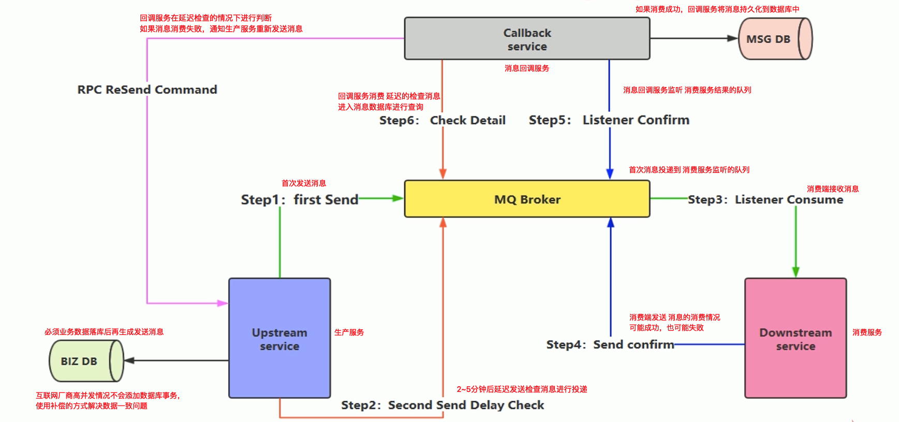

## RabbitMQ高级特性
1. <a href="#1">消息如何保障100%的投递成功？</a>  
2. <a href="#2">幂等性概念详解</a>  
3. <a href="#3">在海量订单产生的业务高峰期，如何避免消息的重复消费问题？</a> 
4. <a href="#4">Confirm确认消息、Return返回消息</a>
5. <a href="#5">自定义消费者</a>
6. <a href="#6">消息的ACK与重回队列</a>
7. <a href="#7">消息的限流</a>
8. <a href="#8">TTL消息</a>
9. <a href="#9">死信队列</a>

### <a name="#1">消息如何保障100%的投递成功？</a>
#### 什么是生产端的可靠性投递？
- 保障消息的成功发出  
- 保障MQ节点的成功接收  
- 发送端收到MQ节点（Broker）确认应答  
- 完善的消息进行补偿机制  
#### 生产端-可靠性投递
BAT/TMD互联网大厂的解决方案：  
- 消息落库，对消息状态进行打标  
  
此方法对数据库有两次数据操作，一次业务，一次消息  
- 消息的延迟投递，做二次确认，回调检查  
第一种投递方式，在高并发下，数据库可能有瓶颈  
  

### <a name="#2">幂等性</a>
#### 幂等性是什么？
借鉴数据库的乐观锁机制：  
执行一条更新库存的SQL语句  
```
update T_REPS set count = count - 1, 
version = version + 1 
where version = 1 

假设 count为库存数量，当count为1时，发生并发问题，count直接 -1 极有可能成为负数  

如何解决？加上版本号
在并发争抢时，因为先执行的SQL version+1成功，后执行的SQL通过where条件查询版本号后，无法执行减库存的操作
```

概括幂等性：对某一事物进行操作，操作可能执行n次，但是每次操作的结果是相同的  

### <a href="#3">在海量订单产生的业务高峰期，如何避免消息的重复消费问题？</a>  
消费端实现幂等性，就意味着，我们的消息永远不会消费多次，即使我们收到了多条一样的消息  
##### 业界主流的幂等性操作：  
- 唯一ID + 指纹码 机制，利用数据库主键去重  
- 利用Redis的原子性去实现  
##### 唯一ID + 指纹码 机制
唯一ID（全局唯一ID） + 指纹码（业务规则、时间戳、或者银行返回的唯一编号）机制，利用数据库主键去重。（为了保证此次操作绝对唯一）  
SELECT COUNT(1) FROM T_ORDER WHERE ID = 唯一ID + 指纹码（如果 result=0，执行insert操作，如果result=1，即已经有操作过的，不再处理）  
好处：实现简单  
坏处：高并发下有数据库写入的性能瓶颈  
解决方案：利用ID进行分库分表进行算法路由  
##### 利用Redis的原子特性实现
- 使用Redis进行幂等，需要考虑的问题  
1. 我们是否要进行数据落库，如果落库的话，关键解决问题是数据库和缓存如何做到原子性？  
2. 如果不进行落库，那么都存储到缓存中，数据可靠性问题、如何设置定时同步的策略？  

### <a href="#4">Confirm确认消息、Return返回消息</a>
#### Confirm 确认消息
理解Confirm消息确认机制：  
- 消息的确认，是指生产者投递消息后，如果Broker收到消息，则会给我们生产者一个应答  
- 生产者进行接收应答，用来确定这条消息是否正常的发送到Broker，这种方式也是消息的可靠性投递的核心保障  
  
#### 如何实现Confirm确认消息？
1. 在channel上开启确认模式：`channel.confirmSelect()`  
2. 在channel上添加监听：`addConfirmListener`，监听成功和失败的返回结果，根据具体的结果对消息进行重新发送、或记录日志等后续处理  